# customer-segmentation-analysis
SQL + Python (RFM Clustering) + Power BI project for customer segmentation and sales insights
# 📊 Customer Segmentation & Sales Insights (SQL + ML + Power BI)

## 🔹 Project Overview
This project demonstrates a **real-world data analytics workflow** across three key domains:
1. **SQL (Data Cleaning & Analysis)** → preparing and analyzing raw retail transactions.  
2. **Machine Learning (Python - Jupyter Notebook)** → RFM analysis and clustering to segment customers.  
3. **Power BI (Visualization & Dashboarding)** → interactive report for business insights.  

The dataset is based on the **Online Retail dataset** (UCI Machine Learning Repository / Kaggle).  

---

## 🔹 Dataset
- **Source**: [Online Retail Dataset – UCI Repository](https://archive.ics.uci.edu/ml/datasets/online+retail)  
- **Format**: Excel/CSV (500k+ rows)  
- **Fields**:
  - `InvoiceNo`: Transaction ID (prefix "C" = cancelled order)  
  - `StockCode`: Product code  
  - `Description`: Product description  
  - `Quantity`: Units bought  
  - `InvoiceDate`: Date of transaction  
  - `UnitPrice`: Price per unit  
  - `CustomerID`: Unique customer identifier  
  - `Country`: Customer location  
## 🔹 Step 1: Data Loading & Cleaning (SQL)

### Create Database & Table
```sql
------------------------------------------------------------
-- Project: Online Retail Analysis (SQL Portfolio Project)
-- Database: RetailDB
-- Author: [Your Name]
-- Purpose: EDA + Business Insights + RFM Preparation
------------------------------------------------------------

-- 1️⃣ Create Database and Use It
------------------------------------------------------------
CREATE DATABASE RetailDB;
USE RetailDB;

-- 2️⃣ Create OnlineRetail Table
------------------------------------------------------------
CREATE TABLE OnlineRetail (
    InvoiceNo NVARCHAR(20),
    StockCode NVARCHAR(20),
    Description NVARCHAR(255),
    Quantity INT,
    InvoiceDate DATETIME,
    UnitPrice FLOAT,
    CustomerID NVARCHAR(20),
    Country NVARCHAR(50)
);

------------------------------------------------------------
-- 📌 Data Cleaning
------------------------------------------------------------

-- Remove null customers
DELETE FROM OnlineRetail WHERE CustomerID IS NULL;

-- Remove cancelled invoices (Invoice starting with 'C')
DELETE FROM OnlineRetail WHERE InvoiceNo LIKE 'C%';

-- Remove negative or zero quantities
DELETE FROM OnlineRetail WHERE Quantity <= 0;

-- Add TotalAmount column
ALTER TABLE OnlineRetail ADD TotalAmount FLOAT;

-- Update TotalAmount = Quantity * UnitPrice
UPDATE OnlineRetail
SET TotalAmount = Quantity * UnitPrice;

------------------------------------------------------------
-- 📌 Basic EDA Queries
------------------------------------------------------------

-- 🔹 1. Monthly Sales Trend
SELECT 
    YEAR(InvoiceDate) AS Year,
    MONTH(InvoiceDate) AS Month,
    SUM(TotalAmount) AS TotalSales
FROM OnlineRetail
GROUP BY YEAR(InvoiceDate), MONTH(InvoiceDate)
ORDER BY Year, Month;

-- 🔹 2. Top 10 Customers by Spend
SELECT TOP 10 
    CustomerID, 
    SUM(TotalAmount) AS TotalSpent
FROM OnlineRetail
GROUP BY CustomerID
ORDER BY TotalSpent DESC;

-- 🔹 3. Top 10 Products by Quantity
SELECT TOP 10 
    Description, 
    SUM(Quantity) AS TotalQuantity
FROM OnlineRetail
GROUP BY Description
ORDER BY TotalQuantity DESC;

-- 🔹 4. Sales by Country
SELECT 
    Country, 
    SUM(TotalAmount) AS TotalSales
FROM OnlineRetail
GROUP BY Country
ORDER BY TotalSales DESC;

------------------------------------------------------------
-- 📌 Intermediate Queries
------------------------------------------------------------

-- 🔹 5. Average Order Value (AOV) per Month
SELECT 
    YEAR(InvoiceDate) AS Year,
    MONTH(InvoiceDate) AS Month,
    SUM(TotalAmount) / COUNT(DISTINCT InvoiceNo) AS AvgOrderValue
FROM OnlineRetail
GROUP BY YEAR(InvoiceDate), MONTH(InvoiceDate)
ORDER BY Year, Month;

-- 🔹 6. Repeat vs One-Time Customers
SELECT 
    CASE WHEN OrderCount = 1 THEN 'One-time Customers'
         ELSE 'Repeat Customers' END AS CustomerType,
    COUNT(CustomerID) AS NumCustomers
FROM (
    SELECT CustomerID, COUNT(DISTINCT InvoiceNo) AS OrderCount
    FROM OnlineRetail
    GROUP BY CustomerID
) t
GROUP BY CASE WHEN OrderCount = 1 THEN 'One-time Customers' ELSE 'Repeat Customers' END;

-- 🔹 7. Countries with Highest Average Order Size
SELECT TOP 10
    Country,
    SUM(TotalAmount) / COUNT(DISTINCT InvoiceNo) AS AvgOrderSize
FROM OnlineRetail
GROUP BY Country
ORDER BY AvgOrderSize DESC;

-- 🔹 8. Daily Sales Pattern (Which Day is Most Profitable?)
SELECT 
    DATENAME(WEEKDAY, InvoiceDate) AS DayOfWeek,
    SUM(TotalAmount) AS TotalSales
FROM OnlineRetail
GROUP BY DATENAME(WEEKDAY, InvoiceDate)
ORDER BY TotalSales DESC;

------------------------------------------------------------
-- 📌 Advanced Queries
------------------------------------------------------------

-- 🔹 9. Cohort Analysis: Monthly Customer Retention
WITH FirstPurchase AS (
    SELECT CustomerID, MIN(InvoiceDate) AS FirstPurchaseDate
    FROM OnlineRetail
    GROUP BY CustomerID
),
Cohort AS (
    SELECT 
        o.CustomerID,
        DATEPART(YEAR, f.FirstPurchaseDate) AS CohortYear,
        DATEPART(MONTH, f.FirstPurchaseDate) AS CohortMonth,
        DATEPART(YEAR, o.InvoiceDate) AS OrderYear,
        DATEPART(MONTH, o.InvoiceDate) AS OrderMonth
    FROM OnlineRetail o
    JOIN FirstPurchase f ON o.CustomerID = f.CustomerID
)
SELECT 
    CohortYear, CohortMonth, 
    OrderYear, OrderMonth,
    COUNT(DISTINCT CustomerID) AS ActiveCustomers
FROM Cohort
GROUP BY CohortYear, CohortMonth, OrderYear, OrderMonth
ORDER BY CohortYear, CohortMonth, OrderYear, OrderMonth;

-- 🔹 10. Pareto Analysis (80/20 Rule: % of Revenue from Top 20% Customers)
WITH CustomerRevenue AS (
    SELECT CustomerID, SUM(TotalAmount) AS Revenue
    FROM OnlineRetail
    GROUP BY CustomerID
),
Ranked AS (
    SELECT CustomerID, Revenue,
           RANK() OVER (ORDER BY Revenue DESC) AS RankByRevenue,
           SUM(Revenue) OVER () AS TotalRevenue
    FROM CustomerRevenue
)
SELECT 
    SUM(Revenue) * 1.0 / MAX(TotalRevenue) * 100 AS RevenueContributionPercent
FROM Ranked
WHERE RankByRevenue <= (0.2 * (SELECT COUNT(*) FROM CustomerRevenue));

-- 🔹 11. Seasonal Sales Trends (e.g., Christmas spike)
SELECT 
    MONTH(InvoiceDate) AS Month,
    SUM(TotalAmount) AS TotalSales
FROM OnlineRetail
GROUP BY MONTH(InvoiceDate)
ORDER BY Month;

-- 🔹 12. Churned Customers (inactive > 6 months)
DECLARE @MaxDate DATE;
SELECT @MaxDate = MAX(InvoiceDate) FROM OnlineRetail;

SELECT 
    CustomerID,
    MAX(InvoiceDate) AS LastPurchaseDate,
    DATEDIFF(DAY, MAX(InvoiceDate), @MaxDate) AS DaysSinceLastPurchase
FROM OnlineRetail
GROUP BY CustomerID
HAVING DATEDIFF(DAY, MAX(InvoiceDate), @MaxDate) > 180;

------------------------------------------------------------
-- 📌 RFM (Recency, Frequency, Monetary) Dataset Preparation
------------------------------------------------------------

DECLARE @LastDate DATE;
SELECT @LastDate = MAX(InvoiceDate) FROM OnlineRetail;

SELECT 
    CustomerID,
    DATEDIFF(DAY, MAX(InvoiceDate), @LastDate) AS Recency,
    COUNT(DISTINCT InvoiceNo) AS Frequency,
    SUM(TotalAmount) AS Monetary
FROM OnlineRetail
GROUP BY CustomerID
ORDER BY Monetary DESC;

SELECT COUNT(*) AS TotalRows FROM OnlineRetail;

-- Count NULL CustomerID
SELECT COUNT(*) AS NullCustomers FROM OnlineRetail WHERE CustomerID IS NULL;

-- Count cancelled invoices
SELECT COUNT(*) AS CancelledInvoices FROM OnlineRetail WHERE InvoiceNo LIKE 'C%';

-- Count rows with Quantity <= 0
SELECT COUNT(*) AS BadQuantity FROM OnlineRetail WHERE Quantity <= 0;


------------------------------------------------------------
-- ✅ END OF SCRIPT
------------------------------------------------------------

```


---


## 🔹 Step 2: Machine Learning (Python - Jupyter Notebook)
```
# Core libraries
import pandas as pd
import matplotlib.pyplot as plt
import seaborn as sns

# ML tools
from sklearn.preprocessing import StandardScaler
from sklearn.cluster import KMeans
- Imported RFM dataset from SQL into Jupyter.  
- Preprocessed data:
  - Handled missing values.  
  - Scaled features using StandardScaler.  
- Applied **K-Means clustering**.  
- Evaluated with **Elbow Method** and **Silhouette Score**.  
- Chose **k=4 clusters**.  

# Load RFM dataset
df = pd.read_csv(r"D:\Projects\Online Retail\RFM_OnlineRetail.csv" , header=None)

# Assign proper column names
df.columns = ['CustomerID', 'Recency', 'Frequency', 'Monetary']

print(df.head())
print(df.columns)
### Cluster Results
- **Cluster 0 – Loyal Customers** → Frequent buyers with healthy spend.  
- **Cluster 1 – Occasional Shoppers** → Infrequent, low-spend customers.  
- **Cluster 2 – Super VIPs** → High spend, very frequent.  
- **Cluster 3 – At Risk** → Very old recency, low spend.
```
📷 *RFM Dataset:*  
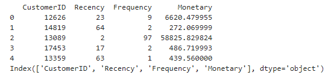  
```
# Dataset Shape
print("Dataset Shape:", df.shape)
print(df.head())
```
📷 *Dataset Shape:*  
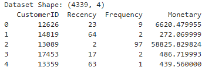  
```
# Check for missing values
print(df.isnull().sum())
```
📷 *Missing Value Check:*  
  
```
# Drop nulls if any
df = df.dropna()

# Scaling the dataset (Feature Scaling)
scaler = StandardScaler()
X = scaler.fit_transform(df[['Recency','Frequency','Monetary']])

print(df.columns)
print(df.head())
```
📷 *Feature Scaling:*  
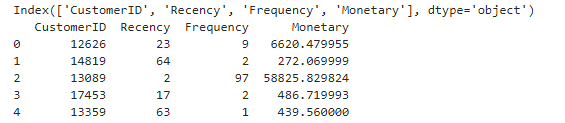  
```
# Elbow Method (Find Optimal k)
wcss = []
for i in range(1, 11):
    kmeans = KMeans(n_clusters=i, random_state=42, n_init=10)
    kmeans.fit(X)
    wcss.append(kmeans.inertia_)

plt.plot(range(1, 11), wcss, marker='o')
plt.xlabel("Number of clusters")
plt.ylabel("WCSS")
plt.title("Elbow Method for Optimal k")
plt.show()
```
📷 *Elbow Method*  
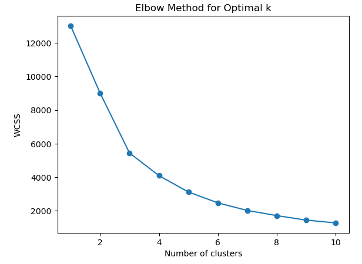  
```
# Try KMeans with k=3
kmeans3 = KMeans(n_clusters=3, random_state=42, n_init=10)
df['Cluster3'] = kmeans3.fit_predict(X)

# Try KMeans with k=4
kmeans4 = KMeans(n_clusters=4, random_state=42, n_init=10)
df['Cluster4'] = kmeans4.fit_predict(X)

# Compare average RFM values for each option
print("===== k=3 Cluster Summary =====")
print(df.groupby('Cluster3')[['Recency','Frequency','Monetary']].mean())

print("\n===== k=4 Cluster Summary =====")
print(df.groupby('Cluster4')[['Recency','Frequency','Monetary']].mean())

# Plot k=3 clusters
sns.scatterplot(data=df, x='Frequency', y='Monetary', hue='Cluster3', palette='tab10')
plt.title("Customer Segments with k=3")
plt.show()

# Plot k=4 clusters
sns.scatterplot(data=df, x='Frequency', y='Monetary', hue='Cluster4', palette='tab10')
plt.title("Customer Segments with k=4")
plt.show()
```
📷 *Cluster Summary*  
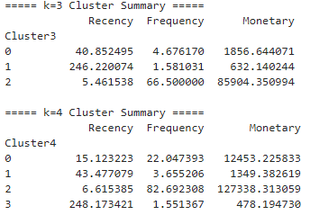  
📷 *Customer Segments*  
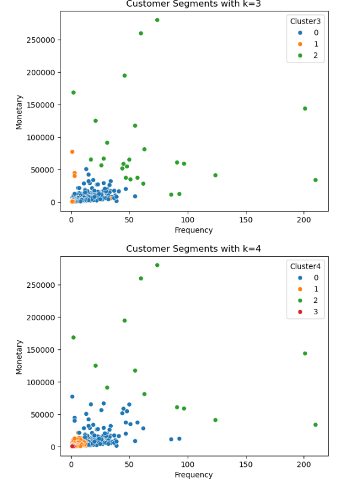  
```
# Train KMeans with k=4
kmeans = KMeans(n_clusters=4, random_state=42, n_init=10)
df['Cluster'] = kmeans.fit_predict(X)

# Verify
print(df.head())
```
📷 *Train with k=4:*  
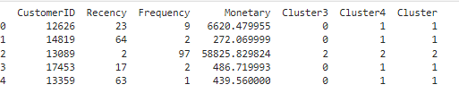  
```
# Average values by cluster
summary = df.groupby('Cluster')[['Recency','Frequency','Monetary']].mean()
print("Cluster Summary (k=4):\n", summary)

# Customer count per cluster
print("\nCustomer counts per cluster:\n", df['Cluster'].value_counts())

# Scatterplots for visualization
sns.scatterplot(data=df, x='Frequency', y='Monetary', hue='Cluster', palette='tab10')
plt.title("Customer Segments by Frequency & Monetary (k=4)")
plt.show()

sns.scatterplot(data=df, x='Recency', y='Monetary', hue='Cluster', palette='tab10')
plt.title("Customer Segments by Recency & Monetary (k=4)")
plt.show()
```

📷 *Customer Count:*  
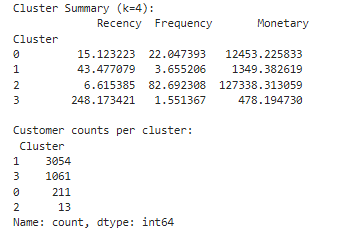  
📷 *Segments by R/F vs M:*  
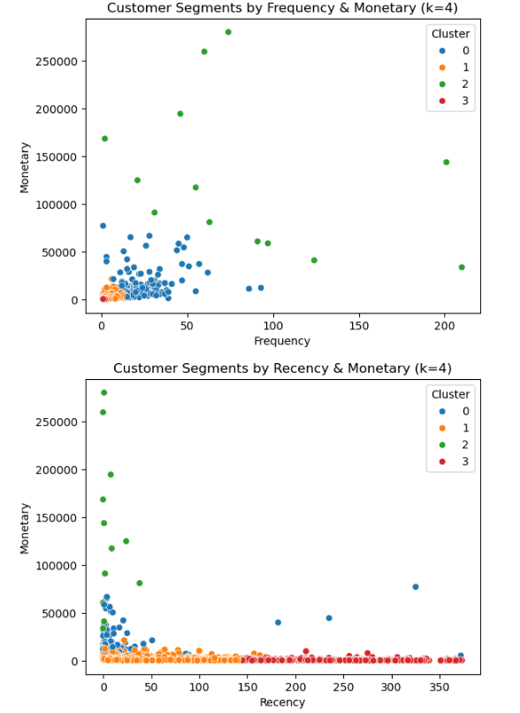  

```
# Map cluster IDs to business-friendly labels
cluster_map = {
    0: "Loyal Customers",
    1: "Occasional Shoppers",
    2: "Super VIPs",
    3: "Churned Customers"
}

df['ClusterLabel'] = df['Cluster'].map(cluster_map)

# Verify
print(df[['CustomerID','Recency','Frequency','Monetary','Cluster','ClusterLabel']].head())
```
📷 *Mapping:*  
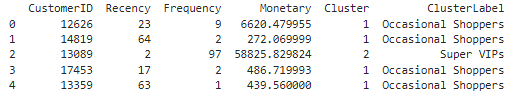  
```
df.groupby("ClusterLabel")[["Recency","Frequency","Monetary"]].mean()
```  
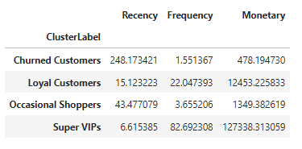  
```
# Bar chart: Number of customers per cluster
sns.countplot(x='ClusterLabel', data=df, order=df['ClusterLabel'].value_counts().index, palette="Set2")
plt.title("Customer Distribution by Segment")
plt.xlabel("Customer Segment")
plt.ylabel("Number of Customers")
plt.xticks(rotation=20)
plt.show()
```
📷 *Bar Chart:*  
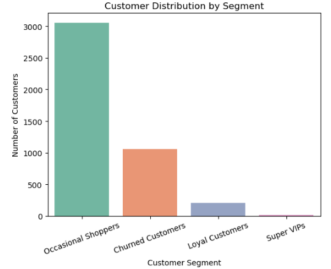  
```

# Scatter: Frequency vs Monetary with labels
sns.scatterplot(data=df, x='Frequency', y='Monetary', hue='ClusterLabel', palette='tab10')
plt.title("Customer Segments (k=4)")
plt.show()
```
📷 *Cluster Plot:*  
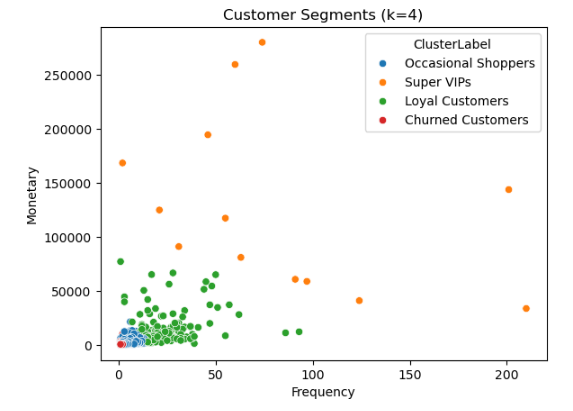  
```
#HeatMap
import seaborn as sns
plt.figure(figsize=(8,5))
sns.heatmap(df.groupby('Cluster')[['Recency','Frequency','Monetary']].mean(), annot=True, cmap="YlGnBu")
plt.title("Average RFM by Cluster")
plt.show()
```
📷 *Heatmap:*  
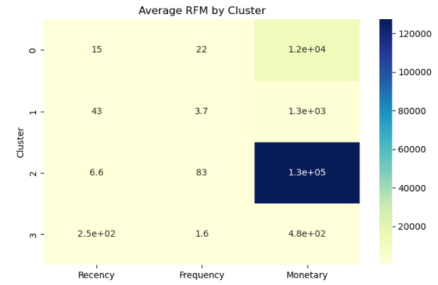  
```
#Exporting the File
df.to_csv("RFM_Clusters.csv", index=False)
print("Clustered dataset with labels saved as RFM_Clusters.csv")
```
Clustered dataset with labels saved as RFM_Clusters.csv


